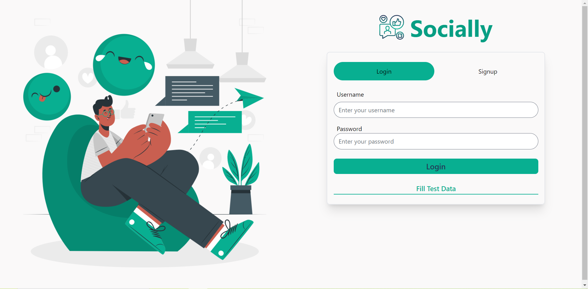
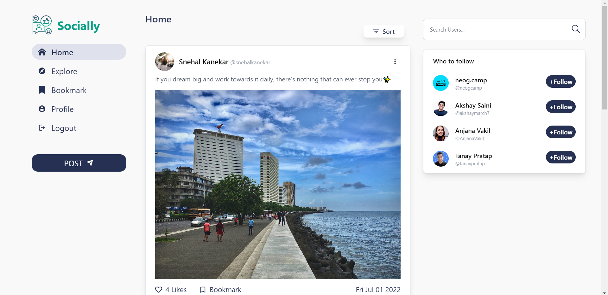
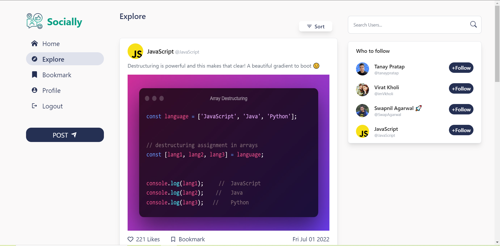
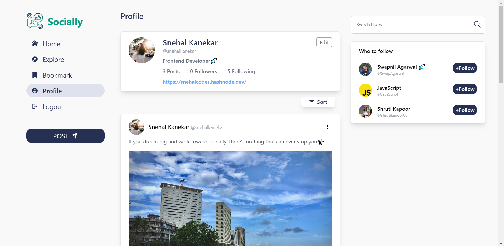

<div align="center">
  

## [Socially](https://socially-media-gules.vercel.app/)

Socially is a platform where people can share their thoughts with their all of their friends and explore what other people's point of view. People can also converse with each other and express their opinions.

## </div>

## How to run the app locally?

```
$ git clone https://github.com/KanekarSnehal/Socially.git
$ cd Socially
$ npm install
$ npm start
```

---

## Deployed Link

Checkout the live demo [here](https://socially-media-gules.vercel.app/)

---

## Built With

- ReactJS
- React Router
- Tailwind CSS
- Redux Tooklkit
- MockBee

---

### Features

- Home page
  - User can see posts of people he/she follows
- Follow Menu Bar
  - Sugeestions of users to follow
- Explore Page
  - User can see posts of other people
- Bookmark Page
  - User can view his bookmark posts
- User Profile Page
  - User can edit his/her profile details- profile photo, bio and link
- Other Users Profile Page
  - User can see other peoples profile page
  - Check their posts
  - Follow/Unfollow user
- Filters for Sorting Posts
  - Sort post by latest, oldest and trending
- Posts
  - User can create post with photos and emoji
  - User can update his/her post
  - User can delete his/her post
  - User can Like and Bookmark a post
- Comments
  - User can add comment with emoji
  - Delete his/her comment
  - Update his/her comment
- User Authentication Pages
  - User Signup
  - User Login

---

# Screens





